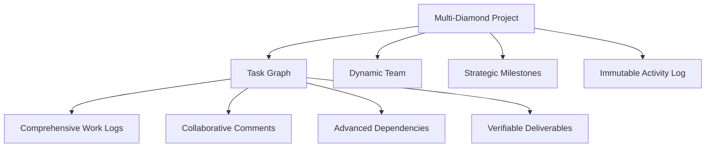

# Multi-Diamond: Decentralized Project Management

A blockchain-native platform for transparent, collaborative project management across multiple stakeholders and complex workflows.

## Overview

Multi-Diamond is an advanced project management solution built on the Stacks blockchain, designed to provide unprecedented transparency, accountability, and flexibility in team collaboration. By leveraging blockchain technology, we create an immutable and verifiable record of project activities.

### Core Features

- 🏗️ Advanced project lifecycle management
- 🔗 Complex task dependency tracking
- 🌐 Multi-stakeholder collaboration
- 🔐 Granular role-based access control
- 📊 Dynamic milestone and deliverable tracking
- ⏱️ Precise work logging and time tracking
- 📝 Transparent activity and audit trails

## Architecture

The platform is built around a sophisticated smart contract that manages intricate project-related data and operations:



## Contract Overview

### Multi-Diamond Manager Contract

The core contract powering our decentralized project management ecosystem.

#### Key Capabilities:
- Adaptive project lifecycle management
- Complex task and dependency modeling
- Role-stratified team collaboration
- Milestone progression tracking
- Granular work and time accounting
- Comprehensive activity documentation

#### Permission Hierarchy:
1. 👑 Owner (Full Platform Control)
2. 🔧 Manager (Strategic Oversight)
3. 🛠️ Contributor (Active Execution)
4. 👀 Viewer (Observational Access)

## Getting Started

### Prerequisites
- Clarinet
- Stacks wallet
- Node.js environment

### Installation

1. Clone the repository
2. Install dependencies
```bash
clarinet install
```
3. Run tests
```bash
clarinet test
```

## Function Reference

### Project Management

```clarity
(create-project (title (string-utf8 100)) 
                (description (string-utf8 500))
                (start-date uint)
                (end-date uint)
                (budget uint))
```

```clarity
(update-project (project-id uint)
                (title (string-utf8 100))
                (description (string-utf8 500))
                (status uint)
                (start-date uint)
                (end-date uint)
                (budget uint))
```

### Task Management

```clarity
(create-task (project-id uint)
             (title (string-utf8 100))
             (description (string-utf8 500))
             (assignee (optional principal))
             (priority uint)
             (estimated-hours uint)
             (start-date uint)
             (due-date uint)
             (milestone-id (optional uint)))
```

```clarity
(update-task-status (project-id uint)
                    (task-id uint)
                    (new-status uint))
```

### Team Management

```clarity
(add-team-member (project-id uint)
                 (member principal)
                 (role uint))
```

```clarity
(update-team-member-role (project-id uint)
                        (member principal)
                        (new-role uint))
```

## Development

### Testing

Run the test suite:
```bash
clarinet test
```

### Local Development

1. Start local chain:
```bash
clarinet integrate
```

2. Deploy contracts:
```bash
clarinet deploy
```

## Security Considerations

1. Role-based access control
   - All sensitive operations require appropriate permissions
   - Owner role cannot be transferred or removed

2. Data Validation
   - All inputs are validated before processing
   - Status transitions are properly controlled

3. Dependency Management
   - Circular dependencies are prevented
   - Task dependencies must be completed before dependent tasks can start

4. State Management
   - Critical state changes are atomic
   - Activity logging provides audit trail

5. Known Limitations
   - No bulk operations supported
   - Cannot delete projects or tasks (only cancel)
   - File storage must be handled off-chain